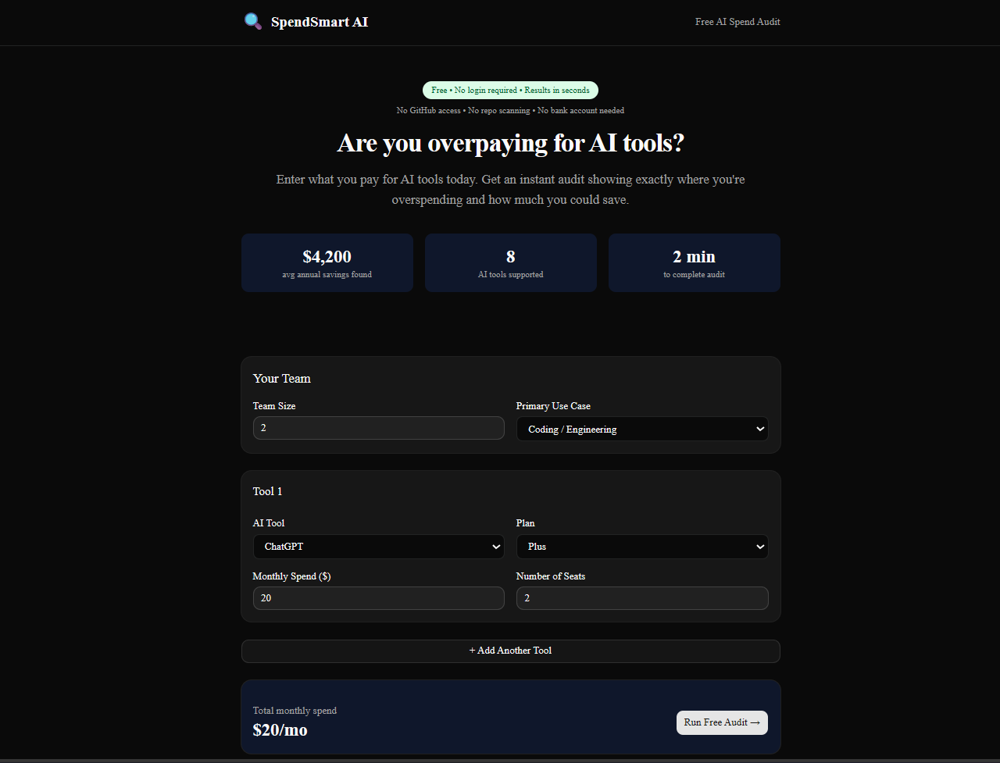
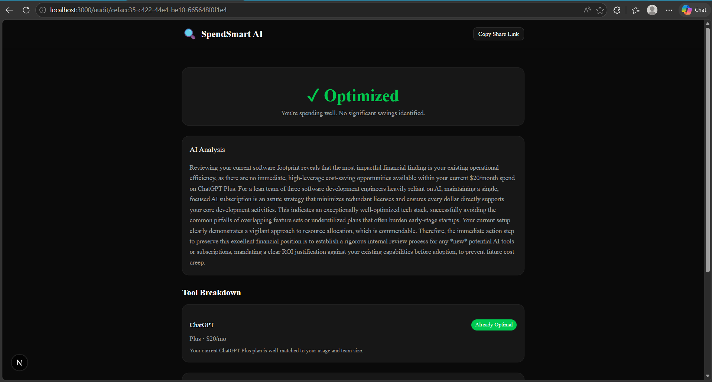
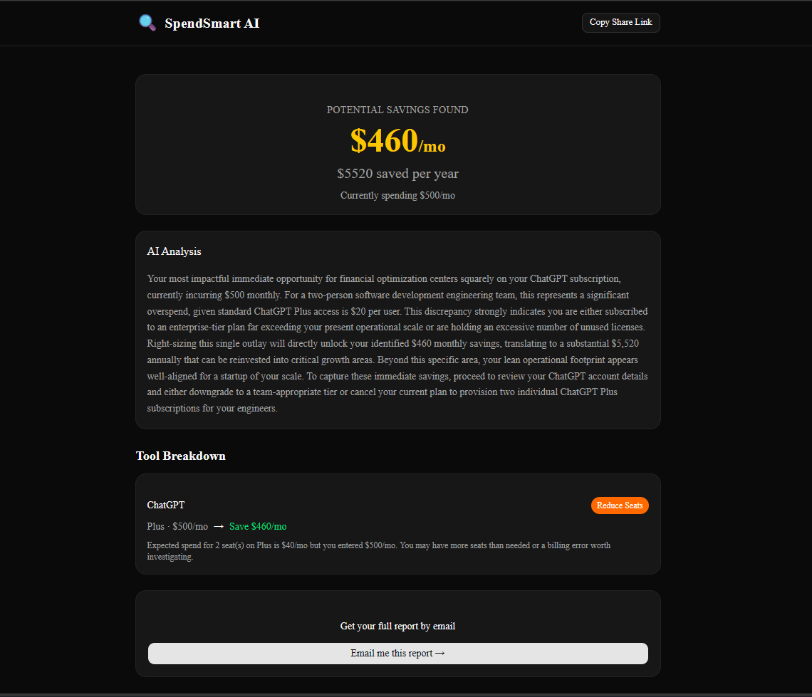

# SpendSmart AI — Free AI Spend Audit

A free web app that audits your AI tool spend and shows exactly where you're 
overpaying — with actionable recommendations and potential savings in seconds.

Built for startup founders and engineering managers who pay for AI tools like 
Cursor, Claude, ChatGPT, GitHub Copilot, and Gemini without knowing if they're 
on the right plan.


## Screenshots

### Landing Page


### Audit Results — Savings Found


### Audit Results — Already Optimized



## Live URL

**https://ai-spend-audit-one-pi.vercel.app**

## Quick Start

```bash
# Clone the repo
git clone https://github.com/Rutik-Phadtare/ai-spend-audit.git
cd ai-spend-audit

# Install dependencies
npm install

# Set up environment variables
cp .env.example .env.local
# Fill in your Firebase and Gemini API keys

# Run locally
npm run dev

# Run tests
npx jest
```

## Environment Variables

```env
NEXT_PUBLIC_FIREBASE_API_KEY=
NEXT_PUBLIC_FIREBASE_AUTH_DOMAIN=
NEXT_PUBLIC_FIREBASE_PROJECT_ID=
NEXT_PUBLIC_FIREBASE_STORAGE_BUCKET=
NEXT_PUBLIC_FIREBASE_MESSAGING_SENDER_ID=
NEXT_PUBLIC_FIREBASE_APP_ID=
GEMINI_API_KEY=
RESEND_API_KEY=
NEXT_PUBLIC_APP_URL=
```

## Decisions

1. **Hardcoded rules over LLM for audit logic** — Audit recommendations are 
financial advice. A finance person must be able to read and verify every number. 
LLMs hallucinate; rule engines don't. AI is used only for the narrative summary 
where some variation is acceptable.

2. **Firebase over Supabase** — Already had a Firebase account. Firestore's 
free tier (50k reads/day, 20k writes/day) is more than enough for this use case 
and requires zero infrastructure setup.

3. **Gemini over Anthropic API for summaries** — Anthropic API requires paid 
credits upfront. Gemini has a genuine free tier. The assignment says "preferred" 
not "required" for Anthropic, and any LLM is acceptable.

4. **Client-side audit engine** — Running `runAudit()` on the client means 
instant feedback with no server round-trip for the core logic. Only persistence 
and AI summary require server calls.

5. **Split server/client components for audit page** — Next.js requires 
`generateMetadata` to be in a Server Component. Splitting into 
`AuditPage` (server) + `AuditPageClient` (client) keeps OG tags working 
without sacrificing interactivity.
